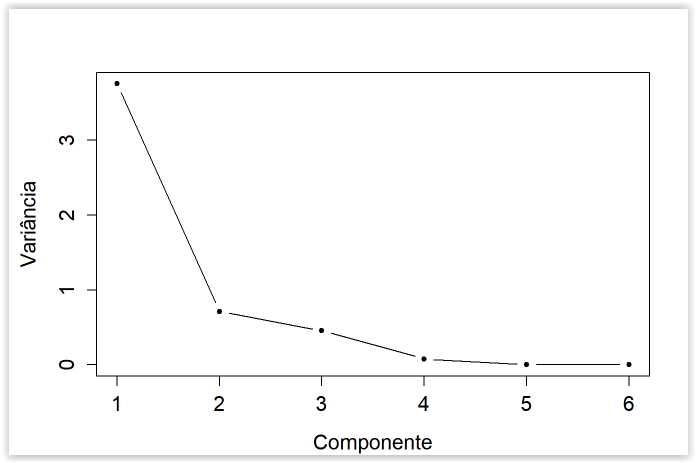
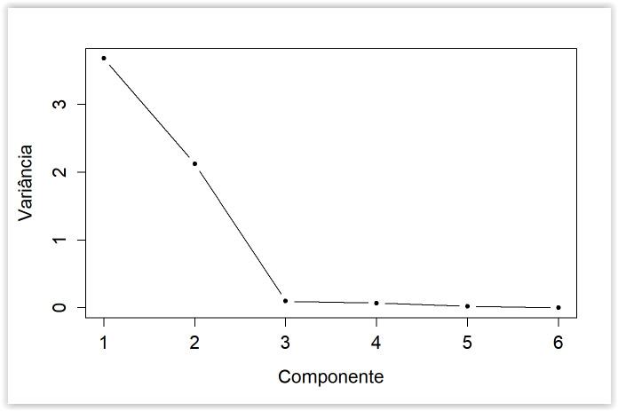
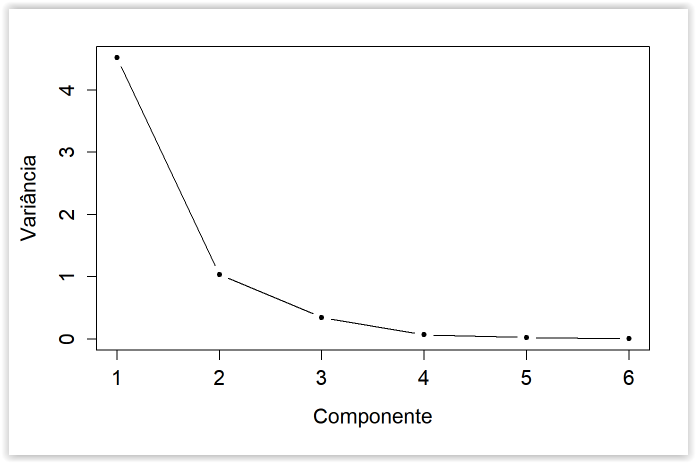
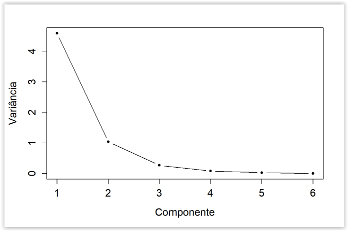
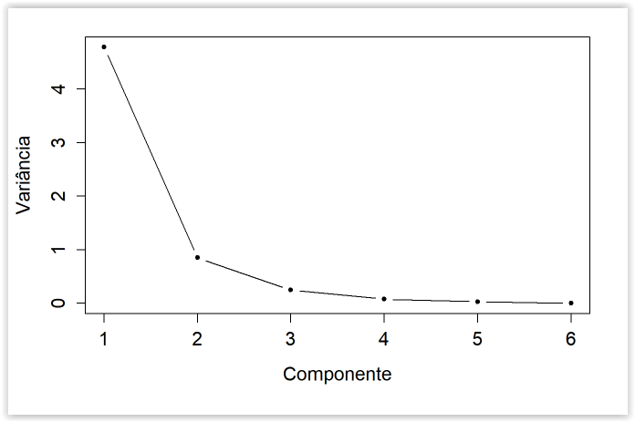
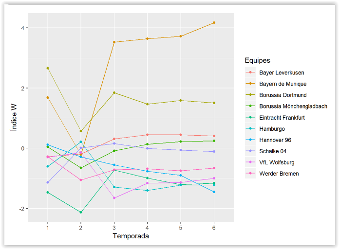

# ComponentesPrincipais
This project does the principal component analysis study for the Bundesliga results from 2011 to 2017.

## Used Liberies

```r
library(rvest)
library(tidyverse)
library(knitr)
library(reshape2)
```

 Webscraping function

```r
    baixandotabela = function(x,b){
    #Pegando a informação da internet
    if (x <14){
    a = paste0("https://pt.wikipedia.org/wiki/Bundesliga_de_20", x,"%E2%80%93",x+1)%>%  read_html() %>%
        html_nodes(".toccolours")%>% html_table(fill = T)%>%.[[b]]}
    else {
        a = paste0("https://pt.wikipedia.org/wiki/Bundesliga_de_20", x,"%E2%80%93",x+1)%>%  read_html() %>%
        html_nodes(".wikitable")%>% html_table(fill = T)%>%.[[b]]}
    
    ta = nrow(a)
    
    #Padronizando os nomes das variáveis
    colnames(a)[1:11] = c("Pos","Equipes", "Pts",  "J",  "V",  "E",  "D",  "GM", "GS", "SG", "X." )  
    a = a %>% 
        select("Pos","Equipes", "Pts",  "J",  "V",  "GM", "SG")
    
    #Adicionando o Ano
    da = data.frame(ANO = rep(x, ta), a)
    da
    }
```
### Dowloading the tables  

```r

tab2011 = baixandotabela(11,1)
tab2012 = baixandotabela(12,1)
tab2013 = baixandotabela(13,1)
tab2014 = baixandotabela(14,2)
tab2015 = baixandotabela(15,4)
# Não foi possível usar o mesmo método para 2016

tab2016 = read.table("Alemão2016.txt", sep = ";", header = T) %>% 
    select("Pos","Equipes", "Pts",  "J",  "V",  "GM", "SG")
tab2016 = data.frame(ANO = rep(16, nrow(tab2016)), tab2016)

```
### Team Selection  

```r
#bind the tables
  todos = rbind(tab2011,tab2012,tab2013,tab2014,tab2015,tab2016)

#At least 5 championships
tab = todos %>% 
  select(Equipes) %>% 
  table() %>% 
  sort(decreasing = T) %>% 
  as.data.frame() %>% 
  filter(Freq >=5)
colnames(tab)[1] = "Equipes"
tab[,1]  = as.character(tab[,1])
tab = tab %>% arrange(Equipes)
kable(tab, caption = 'Equipes Selecionadas')

```

### Data selection

```r

todosselecionado = lapply(tab$Equipes, function(x){ todos %>% 
        arrange(Equipes, Pos) %>%
        filter(Equipes == x)})
todosselecionado
todosselecionado = do.call(rbind, todosselecionado) %>%
  mutate(Titulo = as.integer(Pos == 1)) 

#Corrigindo a variável SG pois ao importar estava com caracteres especiais
todosselecionado$SG = c(26,15,19,25,8,-2,80,71,62,61, 67,55,55,39,42,48,32,5,27,25,
15,16,-4,-4,-11,-8,-28,-22,-24,-25,
30,20,8,2,-1,5,-3,-9,-15,-24,
-16,-17,3,-6,-7,-17,-17,-4,-2,-13,
-17,-29,34,-2,-4,-5,-18)
tab2012$J[6] = 34

```

### function TabelaFinal

```{r}
TabelaFinal = function(ano){ 
  # Selecting Season Data
  ta = todosselecionado %>% 
  filter(ANO <=ano) %>% 
    arrange(Equipes)
  
  #Adding a column as often as each group appears by season
  Freq = ta %>% 
    select(Equipes) %>%
    table() 

  #Group by team
  quasefinal = aggregate(. ~ Equipes, ta, sum) %>%
    mutate(Freq)

  
  #New features
  tabela = quasefinal %>% 
    mutate(AP = Pts/(3*J),
           PV = V/J ,
           PC = Freq/6,
           MS = SG/J,
           GJ= GM/J,
           PP = Titulo/max(Freq)) 
  
  #Only the useful features
  rownames(tabela) = tabela$Equipes
  if (ano == 11){
    tabela = tabela %>%
    select(AP,PV, MS,GJ,PP,PC) 
    tabela[,1:5] = tabela[,1:5]%>% scale()
    tabela = tabela %>% as.matrix()
  } else {
  tabela = tabela %>%
    select(AP,PV, MS,GJ,PP,PC) %>% scale()}
  
  tabela}


```

### applying TabelaFinal function

```r
T1 = TabelaFinal(11)
T2 = TabelaFinal(12)
T3 = TabelaFinal(13)
T4 = TabelaFinal(14)
T5 = TabelaFinal(15)
T6 = TabelaFinal(16)

```

- AP = Achievement (%) represents the percentage of points earned by each team.
- PV = Wins proportion;
- PC = Proportion of Championships played;
- MS = Average goal balance per game;
- GJ = Average number of goals per match;
- Proportion of titles won.

# Principal Component


```r
# Using another function instead prcomp
cpr = function(x){
  v = var(x)
  eigen(v)
}
```

### First Season

```r
cp1 = prcomp(T1)
cp1
summary(cp1)
cpr1 = cpr(T1)
```


The first principal component  accounts for about 75.12% of the total variance of standardized data. If we take the first two main components, we can reach 89.34% of the total variance.

```r
plot(1:6, cp1$sdev^2, type = "b", xlab = "Componente",
 ylab = "Variância", pch = 20, cex.axis = 1.3, cex.lab = 1.3)

```



```r
cp1$sdev[1:2]*t(cp1$rotation[,1:2])
```
The first component has strong correlation with all features except PC.

### Until season two 

```r
cp2 = prcomp(T2)
cp2
summary(cp2)
cpr2 = cpr(T2)
```
The first principal component  accounts for about 61,33%  of the total variance of standardized data. If we take the first two main components, we can reach 96,75% of the total variance.


```r
plot(1:6, cp2$sdev^2, type = "b", xlab = "Componente",
 ylab = "Variância", pch = 20, cex.axis = 1.3, cex.lab = 1.3)

```


```r
cp2$sdev[1:2]*t(cp2$rotation[,1:2])
```

The first compnent has strong correlation with all features

### Until season three 

```r
cp3 = prcomp(T3)
cp3
summary(cp3)
crp3 = cpr(T3)
```

The first principal component  accounts for about 75,31%  of the total variance of standardized data. If we take the first two main components, we can reach 92.62% of the total variance.

```r
plot(1:6, cp3$sdev^2, type = "b", xlab = "Componente",
 ylab = "Variância", pch = 20, cex.axis = 1.3, cex.lab = 1.3)

```


```r
cp3$sdev[1:2]*t(cp3$rotation[,1:2])
```
The first component has strong correlation with all features except PC.

### Until season four 

```r
cp4 = prcomp(T4)
cp4
summary(cp4)
cpr4 = cpr(T4) #usar essa medida
```
The first principal component  accounts for about 75,46%  of the total variance of standardized data. If we take the first two main components, we can reach 93,85% of the total variance.

```r
plot(1:6, cp4$sdev^2, type = "b", xlab = "Componente",
 ylab = "Variância", pch = 20, cex.axis = 1.3, cex.lab = 1.3)

```


```r
cp4$sdev[1:2]*t(cp4$rotation[,1:2])
```

The first component has strong correlation with all features except PC.

### Until season five 

```r
cp5 = prcomp(T5)
cp5
summary(cp5)
cpr5 = cpr(T5)
```
The first principal component  accounts for about 76,39% of the total variance of standardized data. If we take the first two main components, we can reach 93,65% of the total variance.

```r
plot(1:6, cp5$sdev^2, type = "b", xlab = "Componente",
 ylab = "Variância", pch = 20, cex.axis = 1.3, cex.lab = 1.3)

```


```r
cp5$sdev[1:2]*t(cp5$rotation[,1:2])
```

The first component has strong correlation with all features except PC.

### Until season six 

```r
cp6 = prcomp(T6)
cp6
summary(cp6)
cpr6 = cpr(T6)
```

The first principal component  accounts for about 79,72% of the total variance of standardized data. If we take the first two main components, we can reach 93,93% of the total variance.

```r
plot(1:6, cp6$sdev^2, type = "b", xlab = "Componente",
 ylab = "Variância", pch = 20, cex.axis = 1.3, cex.lab = 1.3)

```


```r
cp6$sdev[1:2]*t(cp6$rotation[,1:2])
```

The first component has strong correlation with all features except PC.

# Index W  

The index W is calculated :  
$$W = \frac{(\lambda_1)}{(\lambda_1 + \lambda_2)}Y1 + \frac{(\lambda_2)}{(\lambda_1 + \lambda_2)}Y2 $$  

### Index W function

```r
W = function(x,CP,a){
  if (a == 0 ){
    y1 = -1*x*CP$rotation[,1] 
   y2 = -1*x*CP$rotation[,2]
  }else {
    y1 = x*CP$rotation[,1] 
  y2 = x*CP$rotation[,2]   
   }

  lambda1 = CP$sdev[1]/(CP$sdev[1]+CP$sdev[2])
  lambda2 = CP$sdev[2]/(CP$sdev[1]+CP$sdev[2])
  w1 = lambda1*y1 + lambda2*y2
  W = apply(w1,1,sum)
  cbind(x,W)
}

```

###  Applying W function 

```{r}
W1 = W(T1,cp1,1)
  W2 = W(T2,cp2,1)
  W3 = W(T3,cp3,0)
  W4 = W(T4,cp4,0)
  W5 = W(T5,cp5,0)
  W6 = W(T6,cp6,0)


```

# Evolution Chart
```r
wtodos = rbind(W1[,7], W2[,7], W3[,7], W4[,7], W5[,7], W6[,7])
Dados = melt(wtodos)
colnames(Dados) = c("Temporada", "Equipes", "W")
Dados$Temporada = factor(Dados$Temporada)
```

```r
#Plotando
ggplot(Dados, aes(x = Temporada, y = W, fill = Equipes,  colour=Equipes))  +
  geom_line(aes(group=Equipes))+
  geom_point(aes(group=Equipes)) +
  xlab("Temporada") +
  ylab("Índice W") +
  scale_colour_discrete()
```

We see that the biggest champion, who is Bayern Munich (5 wins from 6 championships), 
stands out in the W Index, is just a drop in his index in the year he was not champion, but his results were only improving what made it have a good distance from the results of the other competing teams